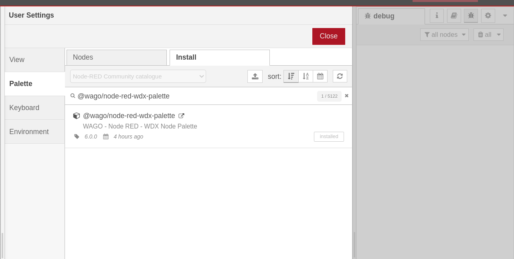
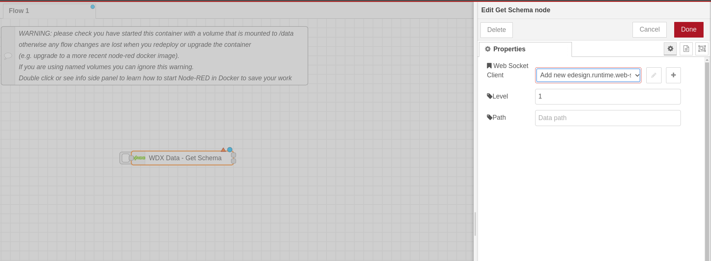

# WDX - Node Red - Palette

Node Red plugin WDX Palette with nodes implementing WDX WS Interface communication within Node Red application.

## Table of Contents

- [Requirements](#requirements)
- [Installation](#installation)
  - [Node RED Palette Management Installation](#node-red-palette-management-installation)
  - [Node RED Manual Package Installation](#node-red-manual-package-installation)
- [Usage](#usage)
- [Examples](#examples)
- [License](#license)


## Requirements
+ WDX Runtime - Docker or local WDX runtime installation.
+ Node-RED editor.
+ Node-RED WDX Pallete.


## Installation


### Node RED Palette Management Installation

Open your Node-RED installation UI palette management and search for package @wago/node-red-wdx-palette.





### Node RED Manual Package installation

Navigate your console to the Node-RED data directory:

```bash
cd ~/.node-red/data # Directory would differ based on your Node-RED installation
```

Install the library, using npm or yarn:

```bash
npm install @wago/node-red-wdx-palette
```

or

```bash
yarn add @wago/node-red-wdx-palette
```


## Usage

To use WDX nodes in your Node-RED flow, follow these steps:

1. Install the `@wago/node-red-wdx-palette` package in your Node-RED project.
2. Import the required nodes into your flow and configure the necessary WDX WS Client options.




## Examples

For more examples see [example project](https://github.com/elrest-cz/wdx-node-red-examples.git).

## License

This library is licensed under the [MIT License](https://en.wikipedia.org/wiki/MIT_License). See the [LICENSE.md](https://github.com/elrest-cz/wdx-ws-client-js/blob/master/LICENSE.md) file for more details.

© 2024 

This `README.md` provides a clear introduction to the TypeScript model schema library, with examples of how to use it, and includes the required copyright and licensing information under the MIT License.